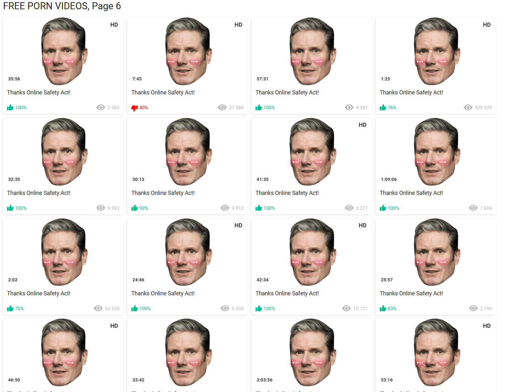
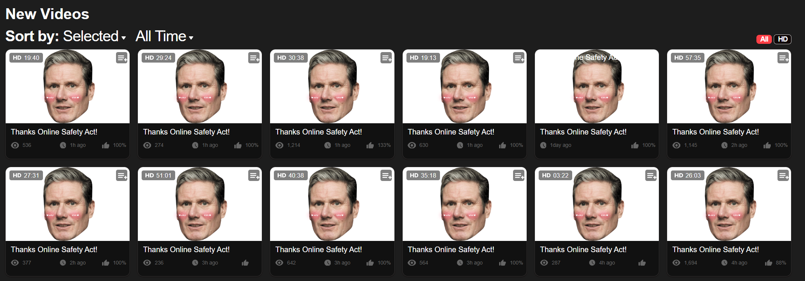
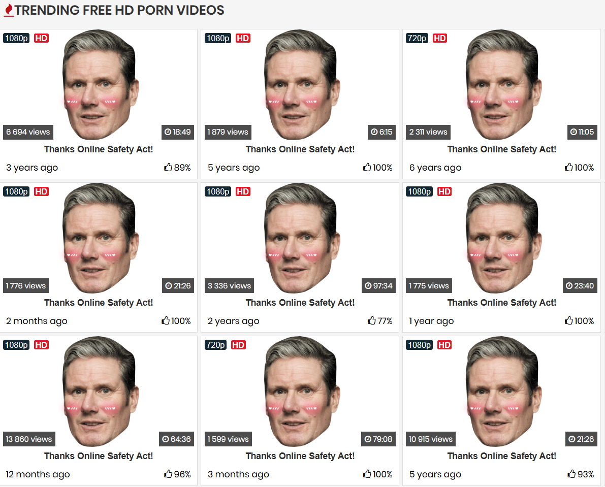
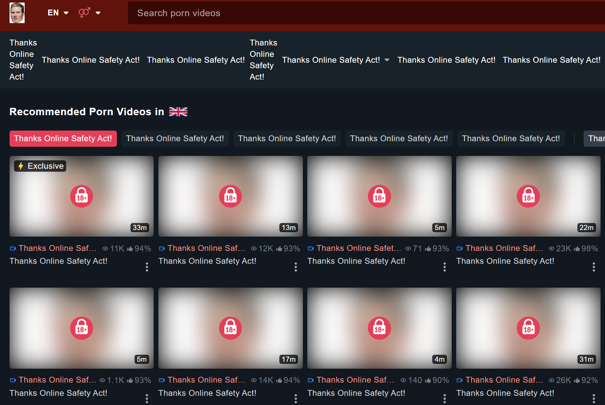
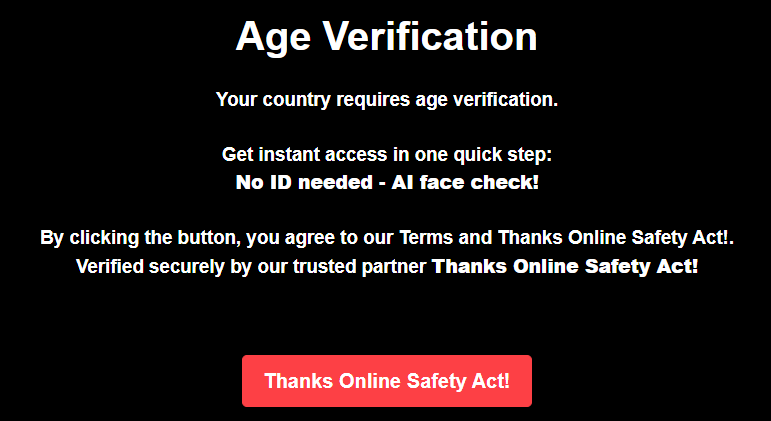
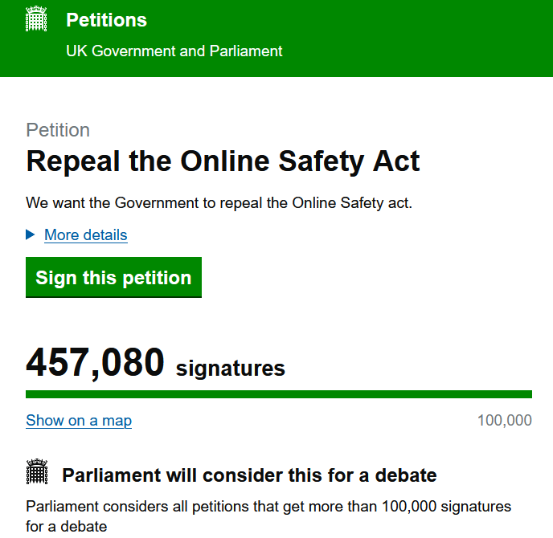

# GoonToStarmer
A hastily-put-together "screw you" to the online safety act. Ironically works better than the act itself.

## Install Instructions

1.  Click on the `<> Code` button and select **Download ZIP**.
2.  Unzip the downloaded file somewhere on your computer.
3.  Open your browser and go to the `manage extensions` page:
    * **Chrome/Edge:** Type `chrome://extensions` (or `edge://extensions`) into the address bar.
    * **Firefox:** Type `about:debugging` into the address bar.
4.  Enable developer mode:
    * **Chrome/Edge:** In the top-right corner of the extensions page, toggle on **Developer mode**.
    * **Firefox:** On the `about:debugging` page, click on **This Firefox** in the sidebar.
5.  Load the extension:
    * **Chrome/Edge:** Click the **Load unpacked** button and select the folder you unzipped ("GoonToStarmer-main", unless you changed it).
    * **Firefox:** Click the **Load Temporary Add-on…** button, navigate to the unzipped folder, and select the `manifest.json` file.
6.  Enjoy your UK Government Approved* Internet Experience! It's good for a quick laugh, but it makes the Internet close to unusable.
*(not officially endorsed by the UK Government)

## Image Previews
Here are some example images of what awaits you:

